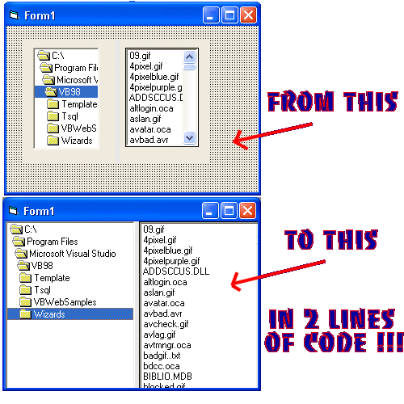



## Control Resize Splitter

### Description

You'll never need to distribute a splitter ocx with your program again with this EASY to USE activeX control!! Simply drop it on your form, add two controls, two lines of code and your done!! if youve ever used the MBSplit control from vb2themax you already know how easy this control is to use. Except now you have source code you can compile directly into your program! No need for multiple classes, unweildy - hard to understand, API calls. This control uses no API! only pure simple vb code, contained in one easy to use control. No modules, dll's, or classes... try it and youll see! This control came about because i becaume frustrated that i had to distribute an ocx with my program in order to get a simple splitter on my form. Without having access to the source code it was impossibly to know whether it contained any API calls that might not work in win9x systems or not. So i decided to make one myself. Here it is now for you to use also, Please leave any bug reports below... *Updated 12/11/03*
 
### More Info
 

             |
---                |---
**Submitted On**   |2003-12-11 19:15:30
**By**             |[Deth](https://github.com/Planet-Source-Code/PSCIndex/blob/master/ByAuthor/deth.md)
**Level**          |Intermediate
**User Rating**    |4.9 (44 globes from 9 users)
**Compatibility**  |VB 4\.0 \(32\-bit\), VB 5\.0, VB 6\.0
**Category**       |[Custom Controls/ Forms/  Menus](https://github.com/Planet-Source-Code/PSCIndex/blob/master/ByCategory/custom-controls-forms-menus__1-4.md)
**World**          |[Visual Basic](https://github.com/Planet-Source-Code/PSCIndex/blob/master/ByWorld/visual-basic.md)
**Archive File**   |[Control\_Re16828312112003\.zip](https://github.com/Planet-Source-Code/deth-control-resize-splitter__1-50395/archive/master.zip)

### API Declarations

NONE!!

